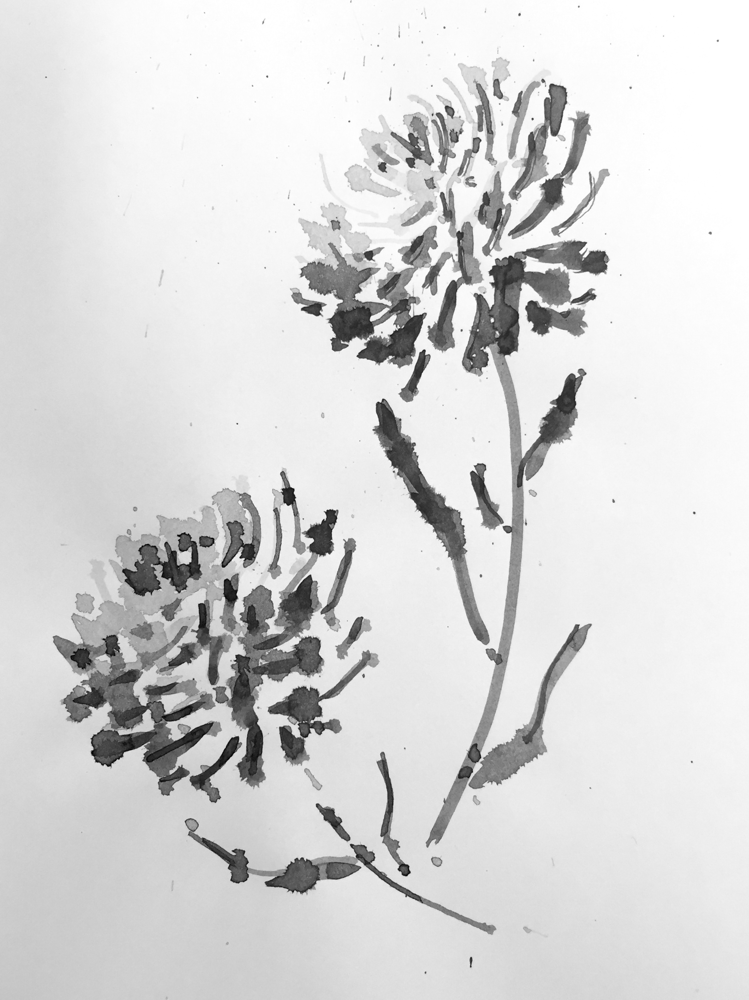
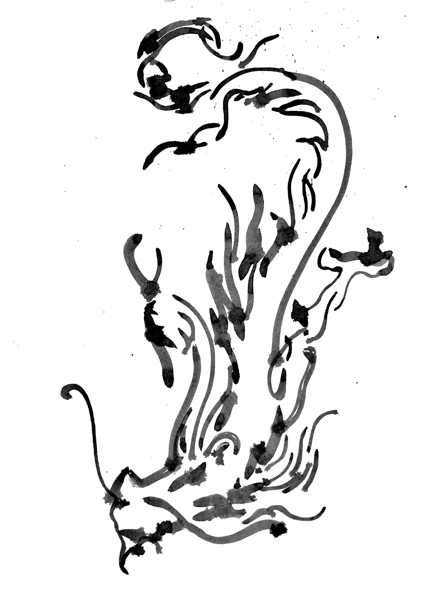
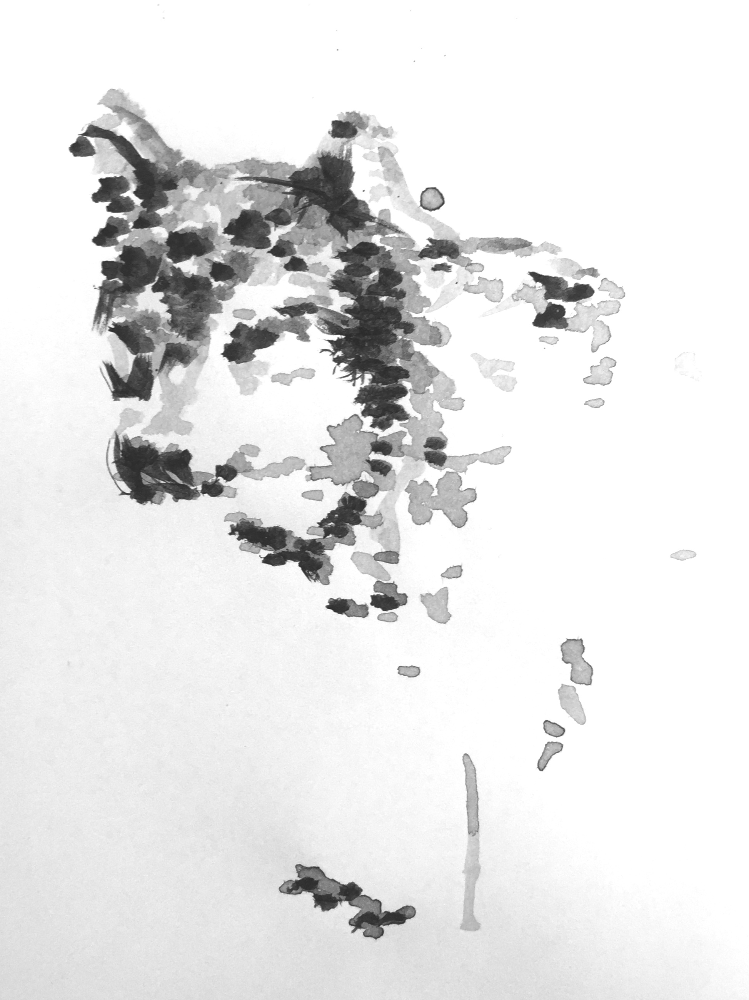
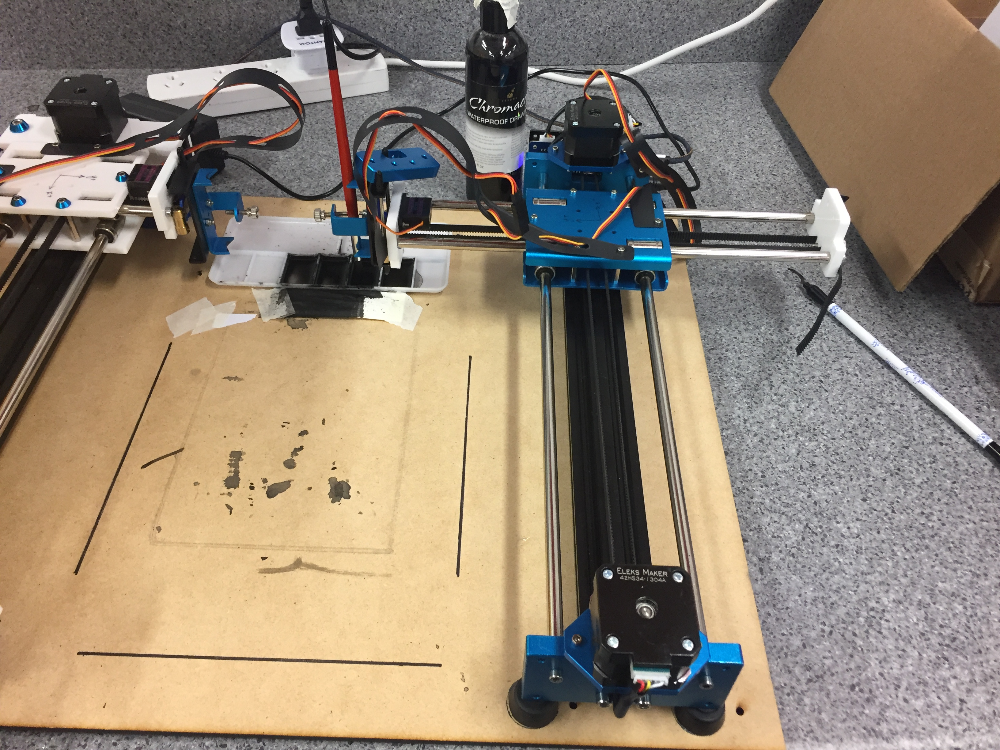

# robot_art_comp_usyd

Code for the International Robot Art Competition  
University of Sydney  
Usyd Robotics Club  
Team RoboLions

# Submission

## Chrysanthemum

## Diving Dragon

## Tamaskan Dog

# Our hardware set-up

# Code

Running main.m inside the matlab folder will produce the relevant g-code that can be sent to the EleksDraw xy-plotter to produce a painting of the input image.

# Acknowledgements

Thank you to everyone who contributed to this project:

Damian Abood, Kelly Lynch, James Wong, and Xue Yin Zhang.

A shout-out to Brian Lee for your indispensable advice along the way; to Catherine Kinsella from the University of Sydney, school of AMME, for supporting this scrappy group of undergraduates to make this project happen; and to Andy Jiang for kindly allowing our team to work in your lab space. Many thanks and much gratitude!